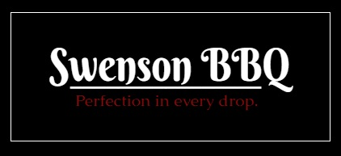

===========
Swenson BBQ
===========

Swenson BBQ is family owned business found in small town *Blankton, 
Iowa*. At Swenson BBQ they pride themselves on honesty, 
non GMP products you can’t miss on a trip to Iowa. 

Swenson BBQ was forged in the fires of tragedy. A friend of the Swenson 
family learned he was gluten intolerant, meaning he could no longer enjoy 
barbeque sauce, what he claimed was “The **only thing** that made eating worth a damn.” 
From there the Swensons got started making their own recipe without gluten for friends and 
family to enjoy. Now everyone who enjoys Swenson Brand barbeque sauce is like a blood 
relative for those passionate folks over at Swenson BBQ.

Swenson BBQ encourages everyone to come try their signature flavors such as *sweet*, 
*mild* and *hot* sauce. They boast on their website that their hot sauce will grant you 
“a chance to meet the Grim Reaper.” With promises like that it isn’t hard to see how 
SwensonBBQ got so popular, and the insane number of subscribers to their monthly newsletter 
emails can attest to that. 