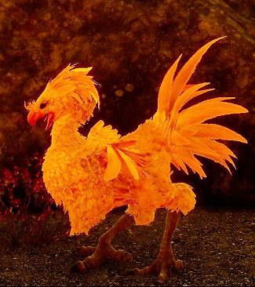
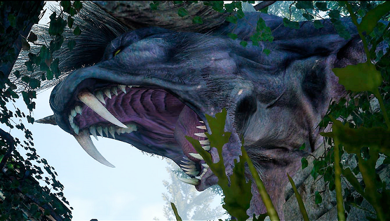

The Iowa International Wildlife Museum
======================================

+---------------+---------------+-------------------+
|Hours          | Admission     |       Themes      |
|               |               |(alternate Monthly)|
+===============+===============+===================+
|Monday- Friday |Adults - $10   |Midwest            |
+---------------+---------------+-------------------+
|8:00- 7:00     |Kids - Free.99 |Arctic             |
+---------------+---------------+-------------------+
|Sat and Sun    |Seniors - $8   |Westeros           |
+---------------+---------------+-------------------+
|8:00- 9:00     |Military -$5   |Duscae             |
+---------------+---------------+-------------------+

Attractions
-----------

This museum is known throughout the world for its wide range of exotic wax figures. Our exhibits rival the very greatest displays in the world. From the great plains to the north and south poles, we have the very greatest animals. But it isn't just animals. We have displays of the great Native Americans of the plains. Come and see the ancient peoples of the new world in their natural habitats even predating the arrival of Christopher Columbus!

**A Fantastic World**

New to our family this year are the fictional worlds of Westeros and Duscae! Though you may leave believing the dragons and White Walkers are real as any other exhibit on display. 

**Dead-eye**
We welcome this month the Great Behemoth Dead-eye! This beast has long tormented the forests of Duscae until being hunted and shipped straight to our doors here.

