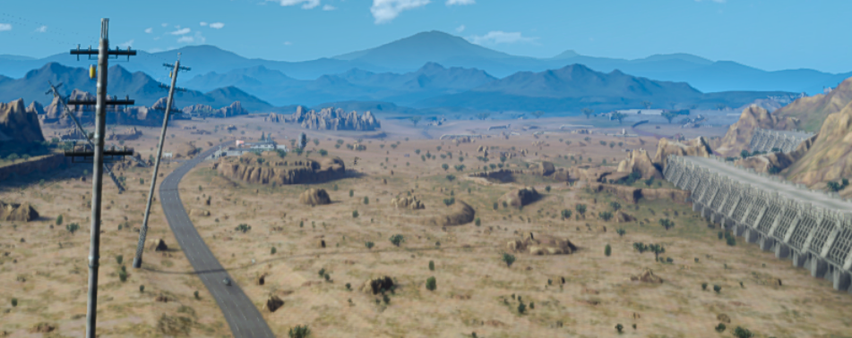

The Pawnee Village Grounds
========================

Some may say this is simply a field in the middle of Ankeny, Iowa. Those folks would be mistaken.

Long ago this field was the location of a Pawnee village. A luscious fertile land was a place where the Buffalo roamed in droves. The Pawnee people lived here for hundred generations. **Pariktaru** or the *Split Horned-ones* rocked their Mohawks with pride and commanded these plains. That is, until the settlers from washed over them. With their strange weapons and the curse of sickness they carried, the indigenous peoples of the plains had no option but to flee.

Now you can visit this great place and see the ruins of their primitive cultures. The area is fantastic tourist attraction selling arrow head and similar collectibles. With that there are dozens of reconstructed sites to visit. 

**The Life of the Pawnee**

You can see how day to day life went and even join in reenacted battles amongst the natives before the influence of the Europeans changed everything. The Pawnee were one of the largest and most feared tribes in the 19th century. Because of the threat to other tribes they were constantly attacked by neighboring villages. The combination of attackers and disease nearly decimated the tribe. With the coming of the Western expansion they were moved to Indian territory. Leaving only memories and a few belongings that we now hold dear here at the Pawnee Village Grounds.