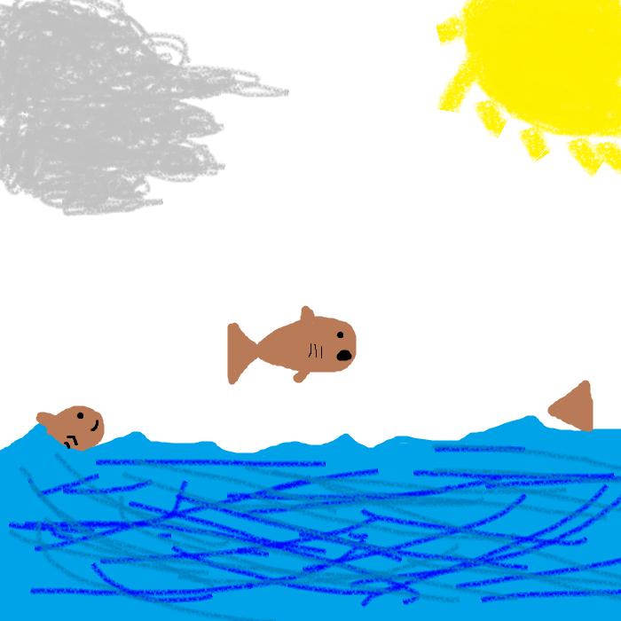

Trout Hatchery in Decorah, Iowa
================================

A great place for any fisherman or outdoorsman to visit is the trout hatchery
located in Decorah, Iowa. This fish hatchery will take trout fish from eggs and
raise them until they are of size to survive in the wild. When you arrive you
will see a grove of concrete containers, each holding a good number of trout fish
all at the same age. Many people bring their whole family along on the trip to
the hatchery to feed the fish and see them all go wild when you toss the fish food
into the water of hundreds of fish. This fish hatchery also has some special
visitors that stop by every now and then. A pair of local bald eagles will swoop
down from time to time and take some of the fish that are being raised in the
hatchery. These bald eagles are a little, “famous”, as in they are the local eagles
that have created a nest and are being livestreamed when they show up for the
winter months to raise their young. If you’re ever by Decorah, make sure to stop
by the trout hatchery just outside of town. You’ll get to see some amazing sized
fish and maybe get to catch a glimpse of an American icon flying over your head.